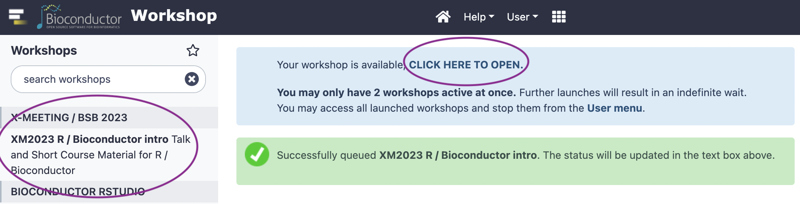

```{r, include = FALSE}
knitr::opts_chunk$set(
  collapse = TRUE,
  comment = "#>"
)
```

# To use this workshop

- Visit https://workshop.bioconductor.org/
- Register or log-in

Already have a workshop? **STOP IT**

1. Choose 'Active workshops' from the 'User' dropdown

   

2. Select the existing workshop, and click the 'Stop' button

    

Start a new workshop

1. choose the 'X-MEETING / BBS 2023'
2. Wait a minute or so
3. Click to open RStudio
4. In RStudio, choose 'File' / 'Open File...' /
   'vignettes/c_course_part_2.Rmd'

    

# Introduction

This workshop walks through a single-cellsis with Bioconductor][OSCA]
(OSCA). The workshop assumes some familiarity with *R*, and sufficient
domain knowledge to know at a superficial level the technical details
and scientific motivation for single-cell analysis. The main goal is
to increase participants' confidence in using *R* to embark on
creative and critical data exploration -- analysis of single cell data
is seldom straight-forward, requiring understanding of methods and
critical assessment of data at many steps.

There are four parts to the workshop, probably we will not have time
to work through all. The first two provide a high-level overview of
how data available in the CELLxGENE portal can be used in the
[Seurat][] (Seurat is not a _Bioconductor_ package) and
[SingleCellExperiment][] / _Bioconductor_ ecosystem.

- [From CELLxGENE to R and Bioconductor_][D]
- [Seurat and Bioconductor workflows][E]

The remaining parts walk through two chapters of [OSCA][], chosen as
much because I wanted to learn a bit more about these steps as for any
other reason.

- [Annotating cell types][F]
- [Differential expression][G]

[OSCA]: https://bioconductor.org/books/release/OSCA/
[Seurat]: https://satijalab.org/seurat/index.html
[SingleCellExperiment]: https://bioconductor.org/packages/SingleCellExperiment

[D]: d_cxg.html
[E]: e_sc_workflows.html
[F]: f_osca_cell_annotation.html
[G]: g_osca_differential_expression.html

# Session information

This document was produced with the following *R* software:

```{r session_info}
sessionInfo()
```

```{r include = FALSE}
## clean up .GlobalEnv at end of vignette
rm(list = ls(envir = .GlobalEnv, all.names = TRUE), envir = .GlobalEnv)
```
