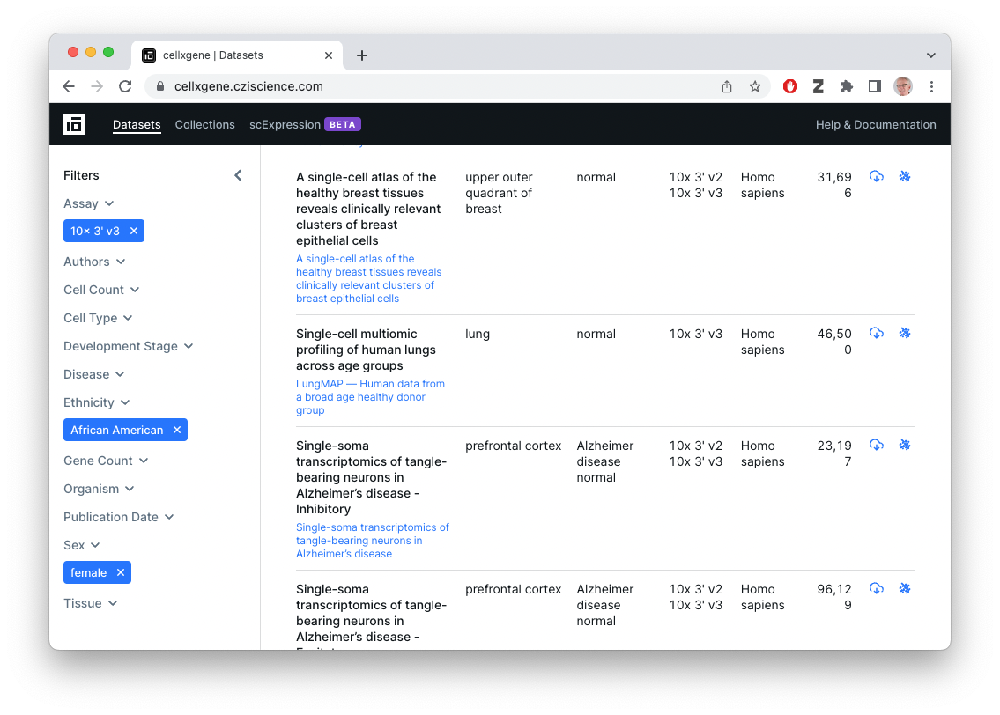

```{r, include = FALSE}
knitr::opts_chunk$set(
  collapse = TRUE,
  comment = "#>"
)
```

We use the following packages during this section of the workshop.

```{r setup, message = FALSE}
## package developed for this workshop
library(XM2023)

## general programming tools
library(dplyr)

## data access
library(cellxgenedp)

## single cell data representation in R
library(SingleCellExperiment) # Bioconductor representation
library(Seurat)               # Seurat representation
```

# Data Transformations

FASTQ files

- DNA sequences and quality scores
- Very large
- Processed e.g., by CellRanger or other software
- Quality control, summary to count matrix (below)

Count matrix

- Usually genes (rows) x cells (columns)
- Can be large (e.g., 30,000 genes x 50,000 cells)
- Usually *very* sparse, e.g., 95% of cells '0'.
- Still large enough to require a decent amount of computing power,
  e.g., 32 GB RAM, 8 CPU for some steps.

Common formats for count matrix data

- CSV file -- lots of zero's so very wasteful of space.
- 'Matrix Market' sparse matrix files, e.g., tuples of <row, column,
  count> for non-zero values.
- HDF5, e.g., [.loom][] or `.h5ad` ([anndata][]).
- RDS -- An *R* file, in *CELLxGENE* these are *Seurat* objects but
  in general they could contain any *R* object.

Matrix representation in _R_

- In-memory sparse matrices: `dgCMatrix` class from the Matrix package
- On-disk representation via *Bioconductor*'s [DelayedArray][] /
  [HDF5Array][].

Counts & annotations

- CSV and Matrix Market files store just counts; usually annotations
  on columns (e.g., what sample did each cell come from?) are stored
  separately.
- HDF5 file formats coordinate row and column annotations with count
  data.
- _R_ software tries to offer a coordinated representation of counts
  and metadata, e.g., the [Seurat][] or *Bioconductor*
  [SingleCellExperiment][] objects.

[anndata]: https://anndata.readthedocs.io/en/latest/index.html
[.loom]: https://linnarssonlab.org/loompy/format/index.html
[DelayedArray]: https://bioconductor.org/packages/DelayedArray
[HDF5Array]: https://bioconductor.org/packages/HDF5Array

# CELLxGENE

[Data Portal][CXG-portal]



What's available?

- Collections and datasets contributed by the single-cell community,
  with some overlap with data sets in the HCA Data Portal.
- FASTQ files
- `.h5ad` or `.RDS` summarized count data and cell metadata, as well
  as reduced-dimension (e.g., UMAP) representations
  - Summarized count files provided by the contributor / individual
    lab, so of uncertain provenance
- Easy to download count data
- Easy to visualize (!)


[HCA-portal]: https://data.humancellatlas.org/
[CXG-portal]: https://cellxgene.cziscience.com/datasets

## Programatic Discovery

Why use an *R* script when the Data Portals exist?

- Easily reproducible
- Flexible exploration of rich & complex data
- Direct integration with *Seurat* or *Bioconductor* single-cell
  workflows

Load the [cellxgenedp][] package

[cellxgenedp]: https://bioconductor.org/packages/cellxgenedp

```{r}
library(cellxgenedp)
```

Retrieve the current database, and use 'tidy' functionality to mimic
the graphical selection in the web browser -- 10x 3' v3 (EFO:0009922)
assay, African American ethnicity, female gender)

```{r}
db <- db()
african_american_female <-
    datasets(db) |>
    dplyr::filter(
        facets_filter(assay, "ontology_term_id", "EFO:0009922"),
        facets_filter(self_reported_ethnicity, "label", "African American"),
        facets_filter(sex, "label", "female")
    )
african_american_female
```

A particular collection is

```{r}
collection_id <- "c9706a92-0e5f-46c1-96d8-20e42467f287"
african_american_female |>
    dplyr::filter(collection_id %in% .env$collection_id)
```

The dataset associated with this collection is

```{r}
dataset <-
    african_american_female |>
    dplyr::filter(collection_id %in% .env$collection_id) |>
    dplyr::select(dataset_id)
dataset_id <-
    dataset |>
    dplyr::pull(dataset_id)
dataset_id
```

The helper function `xm2023_cxg_dataset()` provides
a summary of this dataset.

```{r}
xm2023_cxg_dataset(dataset_id)
```

'Join' selected datasets and files to identify the files associated
with these datasets.

```{r}
selected_files <-
    dplyr::left_join(
        dataset,
        files(db),
        by = "dataset_id"
    )
selected_files
```

Select the first 'CXG' file available in this subset of data; for
reproducibility we retrieve the dataset id...

```{r}
selected_files |>
    dplyr::filter(filetype == "CXG")
```

Visualize this 'CXG' file in the browser...

```{r}
selected_files |>
    dplyr::filter(filetype == "CXG", dataset_id %in% .env$dataset_id) |>
    datasets_visualize()
```

...or select the 'H5AD' or 'RDS' (Seurat) file associated with the
dataset and download it for subsequent processing in _R_

```{r}
seurat_file <-
    selected_files |>
    dplyr::filter(filetype == "RDS", dataset_id %in% .env$dataset_id) |>
    files_download(dry.run = FALSE)

h5ad_file <-
    selected_files |>
    dplyr::filter(filetype == "H5AD", dataset_id == .env$dataset_id) |>
    files_download(dry.run = FALSE)
```

The downloaded file is cached, so the next time access is fast.

# _Seurat_ 

## Data input & representation

Fortunately, CELLxGENE distributes Seurat (v. 4) files, and they can
be input directly.

```{r}
library(Seurat)
seurat <- readRDS(seurat_file)
seurat
```

## Standard workflow

# _Bioconductor_

## Data input & representation

The `SingleCellExperiment` is used to represent 'rectangular' single
cell expression and other data in _R_ / _Bioconductor_. It coordinates
a gene x cell count matricies (`assay()`) with annotations on the
genes (`rowData()`) and columns (`cellData()`), and with
reduced-dimension summaries.

An effective way to represent the `.h5ad` data as a
`SingleCellExperiment` is using `zellkonverter::readH5AD()`.

```{r}
h5ad <- zellkonverter::readH5AD(h5ad_file, reader = "R", use_hdf5 = TRUE)
```

Displaying the object...

```{r}
h5ad
```

...suggests the data available and how to access it -- there are
`r nrow(h5ad)` genes and `r ncol(h5ad)` cells. The 'raw' data include
counts `assays(h5ad, "counts")`, annotations on each gene
(`rowData()`) and cell (`colData()`), etc...

Working with `SingleCellExperiment` objects is described in additional
detail subsequent articles.

## Standard workflow

[SingleCellExperiment]: https://bioconductor.org/packages/SingleCellExperiment
[Seurat]: https://satijalab.org/seurat/
[SeuratDisk]: https://mojaveazure.github.io/seurat-disk/index.html
[SeuratDisk-workflow]: https://mojaveazure.github.io/seurat-disk/articles/convert-anndata.html#converting-from-anndata-to-seurat-via-h5seuratbut this

[anndata-python]: https://anndata.readthedocs.io/en/latest/index.html

# Session information

This document was produced with the following *R* software:

```{r session_info}
sessionInfo()
```

```{r include = FALSE}
## clean up .GlobalEnv at end of vignette
rm(list = ls(envir = .GlobalEnv, all.names = TRUE), envir = .GlobalEnv)
```
